# 집계약괜찮아 MCP

[](https://www.typescriptlang.org/)
[](https://modelcontextprotocol.io/)
[](LICENSE)

> **[카카오 AGENTIC PLAYER 10](https://b.kakao.com/views/PlayMCP/AGENTIC_PlAYER_10) PlayMCP 공모전 제출을 위해 제작한 카카오 MCP 작품입니다.**<br>
> PlayMCP와 Kakao Tools에서 전월세 계약 전 확인을 돕기 위해 개발한 MCP 서버입니다.

주소, 보증금, 월세, 주택 유형과 면적을 바탕으로 도로명주소와 국토교통부 실거래 자료를 조회합니다. 동일 신고 건물의 유사 조건과 입력 가격을 비교하고, 계약 전에 추가로 확인할 신호와 질문 목록을 제공합니다.

> 이 서비스는 전세사기 여부나 계약 안전성을 판정·보장하지 않으며 법률, 금융, 세무 또는 투자 조언을 제공하지 않습니다.

## 이런 질문을 할 수 있어요

```text
미추홀구 용정공원로33 SK Sky VIEW 전세3억 전용60㎡ 어때?
강서구 우현로67 강서힐스테이트 전세5억 전용85㎡ 어때?
분당구 판교역로109 SK HUB 보증금1천 월세110 전용31㎡ 어때?
```

## 주요 기능

| 기능 | 제공 내용 |
| --- | --- |
| 주소 해석 | 도로명·지번·건물명을 법정동과 공식 건물 후보로 변환 |
| 유사 거래 검색 | 동일 신고 건물과 유사 면적의 최근 전월세 자료 조회 |
| 매매가 참고 | 동일 신고 건물의 유사 면적 매매 자료와 보증금 비율 확인 |
| 가격 위치 | 입력 가격이 최근 신고 범위보다 낮은지·비슷한지·높은지 설명 |
| 계약 전 확인 | 추가 확인 신호, 확인 서류, 임대인·중개사 질문 목록 제공 |

## 동작 방식



[다이어그램 원본](docs/diagrams/how-it-works.mmd)

주소 후보가 여러 개이거나 전용면적이 빠지면 임의로 추측하지 않고 사용자에게 필요한 정보를 다시 질문합니다.

## 결과 해석

| 결과 | 의미 |
| --- | --- |
| `NO_ADDITIONAL_PRICE_SIGNAL_FOUND` | 비교 가능한 가격 자료에서 추가 가격 신호를 찾지 못함. 계약 안전을 의미하지 않음 |
| `ADDITIONAL_VERIFICATION_REQUIRED` | 가격, 표본, 매매가 비교 등 추가 확인이 필요함 |
| `INSUFFICIENT_INFORMATION` | 주소·면적·공공데이터가 부족해 계약 단위 비교가 어려움 |

## 제공 도구

| Tool | 역할 |
| --- | --- |
| `resolve_address_region` | 주소를 법정동 후보와 `lawdCode`로 해석 |
| `search_rent_comparables` | 코드와 기간이 확인된 저수준 전월세 신고자료 검색 |
| `compare_contract_terms` | 동일 신고 건물의 유사 전월세·매매 자료 비교 |
| `detect_precontract_check_signals` | 가격 위치와 계약 전 추가 확인 신호 제공 |
| `generate_question_checklist` | 확인 서류와 임대인·중개사 질문 목록 생성 |

모든 도구는 읽기 전용이며 PlayMCP용 descriptions와 MCP tool annotations를 제공합니다.

## 빠른 시작

Node.js 20 이상이 필요합니다.

```bash
git clone https://github.com/ChoBazzi/jipgyeyak-gwaenchana-mcp.git
cd jipgyeyak-gwaenchana-mcp
npm ci
cp .env.example .env
```

`.env`에 두 API 키를 입력합니다.

```dotenv
MOLIT_OPEN_DATA_API_KEY=
JUSO_API_KEY=
```

- `MOLIT_OPEN_DATA_API_KEY`: 공공데이터포털 국토교통부 전월세·매매 실거래 API 키
- `JUSO_API_KEY`: 도로명주소 주소기반산업지원서비스 검색 API 키

주택 유형별 전월세 및 매매 API는 공공데이터포털에서 각각 활용 신청과 승인이 필요합니다. 전체 설정값은 [.env.example](.env.example)에서 확인할 수 있으며 실제 키가 들어 있는 `.env`는 커밋하지 마세요.

## 실행

### Streamable HTTP

```bash
npm run dev:http
```

기본 엔드포인트는 `POST /mcp`입니다.

| 상태 확인 | 용도 |
| --- | --- |
| `GET /health` | 서버 프로세스 생존 여부 확인 |
| `GET /ready` | 국토부·도로명주소 API 키 준비 여부 확인 |

### STDIO

```bash
npm run build
npm run start:stdio
```

### Docker

API 키 없이 이미지를 빌드하고 실행할 때 환경변수를 주입합니다.

```bash
docker build -t jipgyeyak-gwaenchana-mcp:local .
docker run --rm -p 8080:8080 --env-file .env jipgyeyak-gwaenchana-mcp:local
```

## 데이터와 한계

- 도로명주소 API는 입력 주소를 행정구역과 공식 건물명 후보로 해석합니다.
- 국토교통부 API는 법정동과 신고 건물·단지명이 일치하는 전월세·매매 자료를 제공합니다.
- 두 API에는 공통 건물관리번호가 없어 개별 동·호 동일성까지 자동으로 확인하지 못합니다.
- 비교 면적은 아파트·오피스텔·연립다세대의 경우 전용면적을 사용합니다.
- API 키가 없거나 조회가 실패하면 가짜·예시 거래를 반환하지 않고 정보 부족 원인과 다음 행동을 안내합니다.
- 등기부등본, 건축물대장, 임대인 권리관계, 전입신고와 보증보험 가능 여부는 자동 확인하지 않습니다.
- 주소에는 건물까지만 입력하고 동·호수, 이름, 전화번호, 이메일 등 개인정보를 넣지 마세요.

## 개발 명령어

```bash
npm test
npm run typecheck
npm run build
```

## 라이선스

[MIT License](LICENSE) © 2026 ChoBazzi
